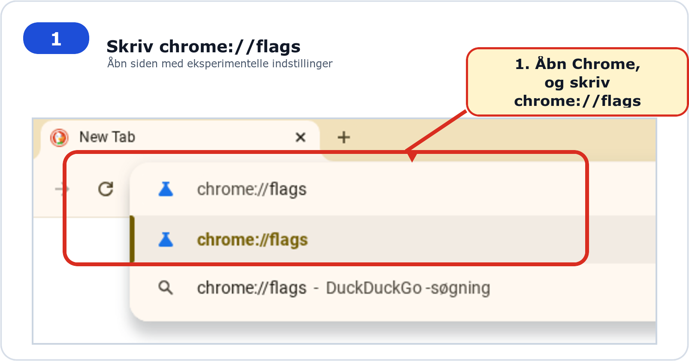
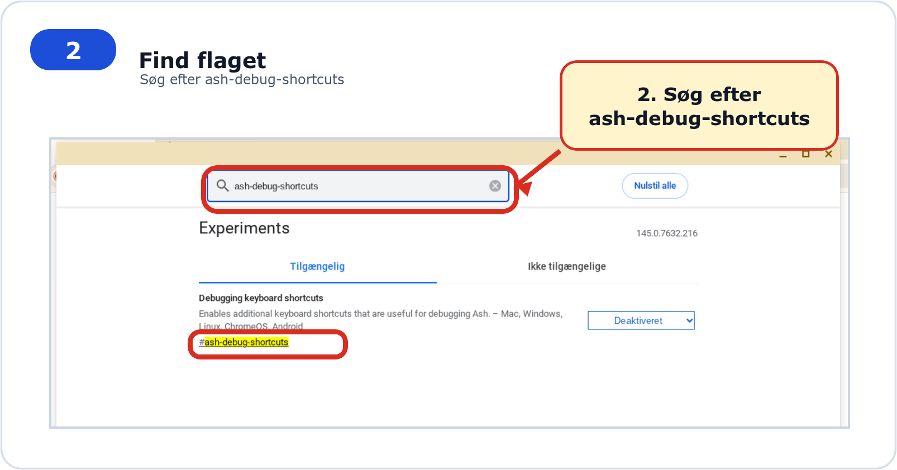
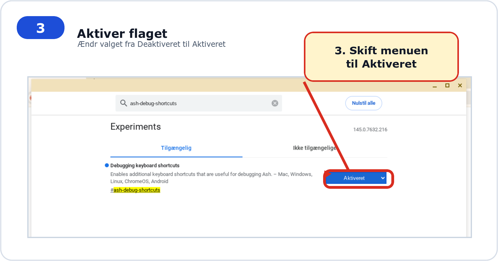
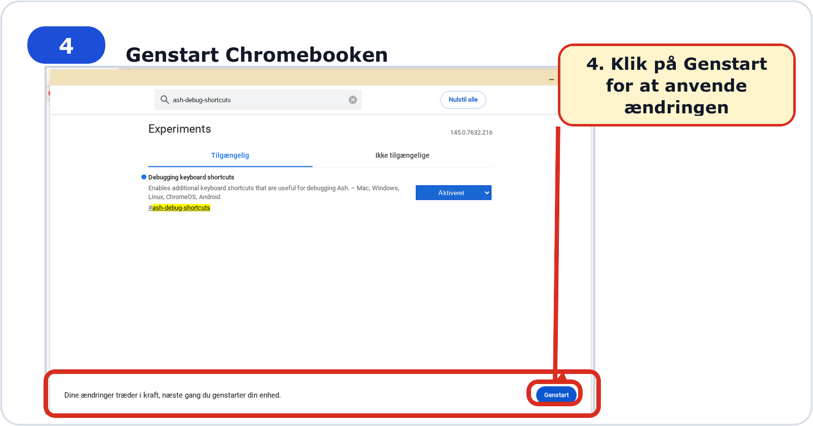
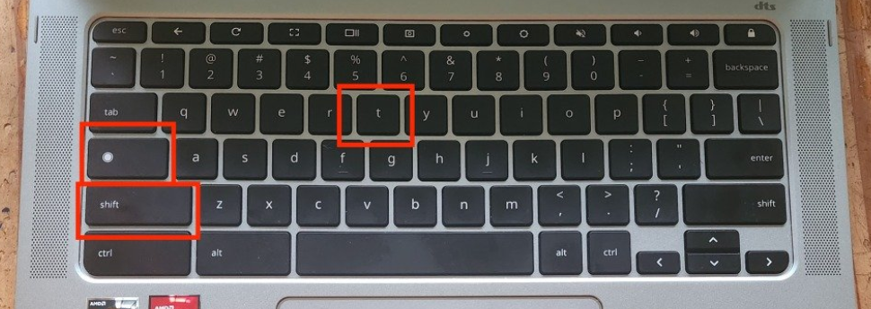

# Hvordan slår jeg touch-funktionen fra?

## Formål

Slå touchfunktionen fra på en Chromebook via Chrome-flags og genvejstaster.

## Hvornår skal jeg bruge denne guide?

Brug guiden, hvis touchskærmen forstyrrer undervisning eller almindelig brug.

1. Åben din Chrome browser, og indtast: `chrome://flags` i URL-baren.

<figure><figcaption></figcaption></figure>

2. Søg efter `#ash-debug-shortcuts`&#x20;

<figure><figcaption></figcaption></figure>

3. Sæt den fra "**Deaktiveret**" til "**Aktiveret**"

<figure><figcaption></figcaption></figure>

3. Tryk på "**Genstart**"

<figure><figcaption></figcaption></figure>

4. Når du har genstartet, kan du nu deaktivere touch screen med følgende genvejstast-kombiniation: **SHIFT + SØG + T**

<figure><figcaption></figcaption></figure>

5. Touch-skærmen vil nu være slået fra, indtil du bruger "**SHIFT + SØG + T**" kombinationen igen.

## Hvis det ikke virker


Prøv at gennemgå trinnene én gang til fra starten. Hvis problemet fortsætter, så skriv til EDB Pede på Aula og nævn hvilken guide og hvilket trin du sidder fast ved.


## Relaterede guides

- [Chromebook og første dag](README.md)
